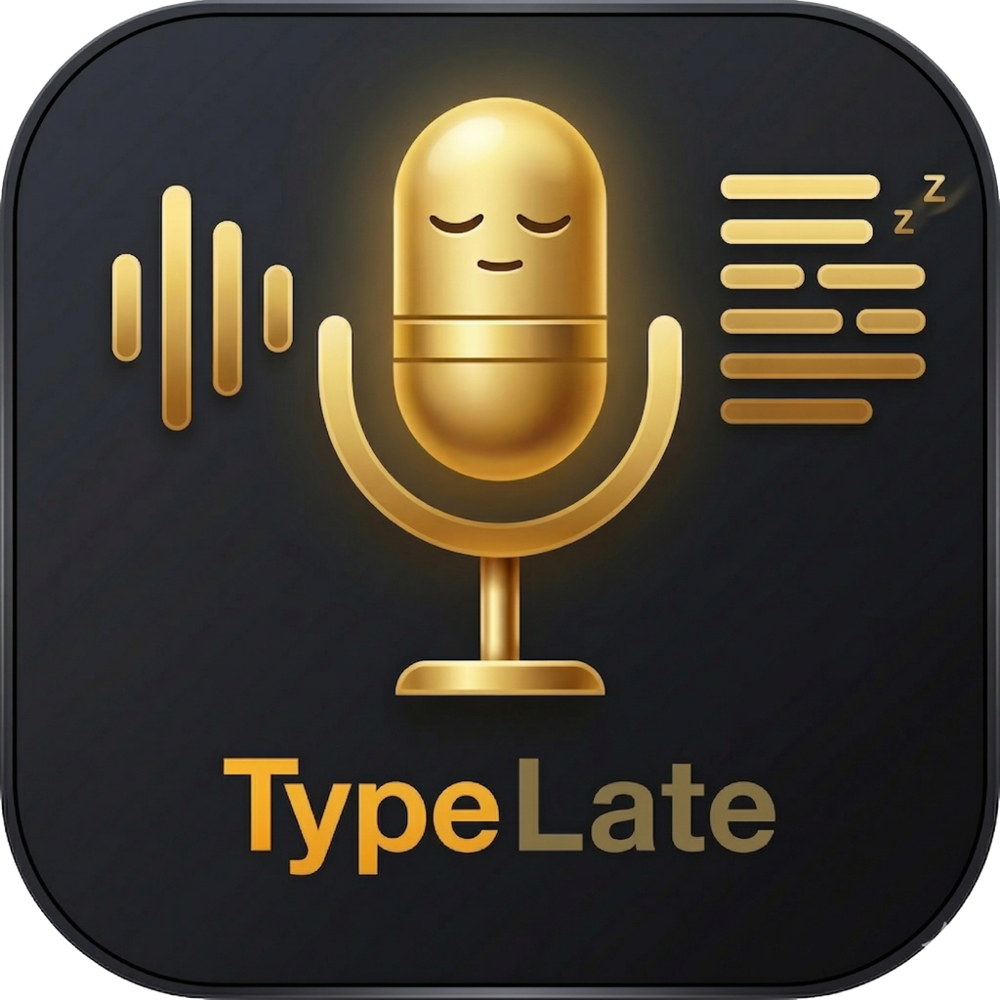

**繁體中文** | [English](README.md)

<div align="center">
  

  # TypeLate

  **打字太累？用說的才對味！**

  開口說，AI 潤稿，你的詞彙最對味。按下快捷鍵、自然說話、放開 — 3 秒內語音變成精修文字。

  [](LICENSE)
  [](https://github.com/bobo52310/TypeLate/releases/latest)
  

  
</div>

> Android 版也已開源：[TypeLate-android](https://github.com/bobo52310/TypeLate-android) — 同樣的 Groq Whisper 語音轉錄、LLM 增強、詞彙同步，以 Kotlin + Jetpack Compose 打造。

## 三步完成

| 步驟 | 動作 |
| :--: | ---- |
| **1. 按住快捷鍵** | 在任何應用程式中按住 `Fn` 鍵（或你的自訂快捷鍵）。 |
| **2. 自然說話** | 用平常說話的方式，不用字正腔圓。 |
| **3. 文字出現** | AI 轉錄、依你的自訂 Prompt 潤稿，貼上游標處，3 秒完成。 |

### 看看差異

> **原始語音輸入**
>
> *「就是呃我在想就是那個我們是不是呃應該把會議改到禮拜四之類的因為呃你知道客戶禮拜一沒辦法來」*
>
> **AI 潤稿輸出**
>
> 「建議將會議移至週四，因為客戶週一無法出席。」

## 誰適合使用

| 角色 | 使用場景 | 常用 App |
| ---- | -------- | -------- |
| **開發者** | 口述 PR 描述、Slack 回覆、程式碼註解，不用切換視窗。 | VS Code, Slack, GitHub |
| **寫作者** | 用說話的速度起草部落格、email、文件。讓 AI 處理潤飾。 | Notion, Gmail, Pages |
| **多語言工作者** | 隨時切換語言，雙語會議紀錄和跨團隊溝通的最佳幫手。 | LINE, Telegram, Notes |
| **無障礙需求** | 用語音在任何地方輸入。減少重複打字的負擔 — 對 RSI 友善，支援完全免手操作。 | Any App |

## 下載

| 平台 | 連結 |
| --- | --- |
| macOS (Apple Silicon) | [TypeLate-mac-arm64.dmg](https://github.com/bobo52310/TypeLate/releases/latest/download/TypeLate-mac-arm64.dmg) |
| macOS (Intel) | [TypeLate-mac-x64.dmg](https://github.com/bobo52310/TypeLate/releases/latest/download/TypeLate-mac-x64.dmg) |
| Windows | [TypeLate-windows-x64.exe](https://github.com/bobo52310/TypeLate/releases/latest/download/TypeLate-windows-x64.exe) |

## 快速開始

1. 下載並安裝 TypeLate。
2. 開啟 TypeLate。
3. 進入設定，輸入你的 [Groq API Key](https://console.groq.com/keys)（免費取得）。
4. 在任何應用程式中，按住 `Fn` 鍵（預設），說話，然後放開。轉錄文字會自動貼上到游標位置。

## 功能特色

### 隨處可用

按住、切換或雙擊，在任何 app 中使用。`Fn` 鍵為預設，完全可自訂。系統層級整合 — 能打字的地方，就能用說的。

### AI 智慧潤稿

AI 自動潤飾語音為乾淨文字 — 去除贅詞、修正文法。可自訂 Prompt，打造專屬潤稿風格。三種增強模式：
- **Clean（清理）** — 僅修正錯誤，保留你的原始語氣
- **Format（格式化）** — 重組為段落、列表或結構化文字
- **Custom（自訂）** — 自己寫 prompt，完全掌控輸出

### 3 秒內完成

由 Groq 驅動的端對端處理 — 目前最快的推理引擎。語音轉錄加 LLM 增強在 3 秒內完成。

### 情境感知

根據使用的 app 自動調整語氣 — Email 正式、聊天輕鬆、IDE 技術精確：
- **Email**（Mail、Outlook）— 正式專業
- **Chat**（Slack、Discord、Teams）— 輕鬆簡潔
- **Code Editor**（VS Code、Xcode、Terminal）— 技術精確
- **Notes**（Obsidian、Notion、Bear）— 自然書寫

同時讀取游標附近的上下文文字，讓 AI 產出更連貫的內容。

### 你的字典，隨身帶著走

建立專屬詞彙庫，透過 Google Drive 在 macOS 與 Android 間同步 — 你的自訂字典隨身帶著走。
- **自訂詞彙** — 教 TypeLate 你的專有名詞和技術術語。支援批次匯入。
- **自動學習** — AI 偵測到你在貼上後修正了轉錄內容，會自動學習正確用詞。
- **Google Drive 同步** — 雙向同步，跨裝置保持詞彙一致。

### 錄音管理

- 可設定保留策略：永久保留、30 / 14 / 7 天，或不保留
- 從歷史紀錄直接播放過去的錄音
- 用不同設定重新轉錄既有音訊

### 音效回饋

五種內建音效主題（Default、Gentle、Minimal、Retro、Custom），支援自訂音效檔。可在錄音時自動靜音系統音訊，防止迴音。

### 歷史與數據分析

所有轉錄自動儲存，支援全文搜尋。儀表板提供：
- 使用統計（總錄音時間、總字元數、轉錄次數）
- 30 天使用趨勢圖
- 各模型成本追蹤
- 每日免費額度監控

### Notch 風格 HUD 浮層

極簡的置頂浮層，顯示錄音狀態、波形和轉錄結果，不打斷你的工作流程。錄音時顯示目前應用程式的圖示。

### 多語言介面

支援英文、日文、韓文、簡體中文、繁體中文。

### 自備 Key，資料你的

API Key 留在你的電腦。語音從麥克風直達 AI，零遙測伺服器。TypeLate 是開源的 — 你可以自行驗證。

## 架構

TypeLate 採用雙視窗架構：

```
┌─────────────────────────────────────────────────┐
│              Tauri 後端 (Rust)                    │
│  全域快捷鍵 · 剪貼簿 · 音訊控制                    │
│  錄音 · 語音轉錄 · 音效                           │
│                                                 │
│  ┌── invoke() ──┐     ┌── emit() ──┐           │
│  │              │     │            │           │
│  ▼              ▼     ▼            ▼           │
│ ┌──────────┐  ┌───────────────────────────┐    │
│ │   HUD    │  │        Dashboard          │    │
│ │  浮層     │  │  設定 / 歷史紀錄 /         │    │
│ │ 400×100  │  │  字典 / 數據分析            │    │
│ │  置頂     │  │  960×680                  │    │
│ └──────────┘  └───────────────────────────┘    │
│  label:main    label:main-window               │
└─────────────────────────────────────────────────┘
```

- **HUD 視窗** — 小型透明置頂浮層（notch 風格），顯示語音流程狀態：閒置、錄音中、轉錄中、結果。
- **Dashboard 視窗** — 主應用程式視窗，包含設定、轉錄歷史、詞彙字典、使用分析。

Rust 後端與 React 前端透過 Tauri 的 IPC 系統溝通：`invoke()` 用於前端對後端的指令，`emit()` 用於後端對前端的事件。

## 技術棧

| 層級 | 技術 |
| --- | --- |
| 桌面框架 | [Tauri v2](https://v2.tauri.app/)（Rust 後端） |
| 前端 | [React 19](https://react.dev/) + TypeScript |
| 狀態管理 | [Zustand 5](https://zustand.docs.pmnd.rs/) |
| 路由 | [TanStack Router](https://tanstack.com/router) |
| UI 元件 | [shadcn/ui](https://ui.shadcn.com/) + [Radix UI](https://www.radix-ui.com/) |
| 樣式 | [Tailwind CSS v4](https://tailwindcss.com/) |
| 圖示 | [Lucide React](https://lucide.dev/) |
| 圖表 | [Recharts](https://recharts.org/) |
| 資料庫 | SQLite via [tauri-plugin-sql](https://v2.tauri.app/plugin/sql/) |
| 設定儲存 | [tauri-plugin-store](https://v2.tauri.app/plugin/store/) |
| AI / 語音 | [Groq API](https://groq.com/)（Whisper 語音轉文字、LLM 文字增強） |
| 國際化 | [i18next](https://www.i18next.com/) + [react-i18next](https://react.i18next.com/) |
| 錯誤追蹤 | [Sentry](https://sentry.io/) |
| 測試 | [Vitest](https://vitest.dev/) + [Testing Library](https://testing-library.com/) |

## 開發

### 前置需求

- [Node.js](https://nodejs.org/) 20+
- [Rust](https://www.rust-lang.org/tools/install) 1.77+（stable）
- [pnpm](https://pnpm.io/) 10+
- Xcode Command Line Tools（僅 macOS）

### 設定

```bash
git clone https://github.com/bobo52310/TypeLate.git
cd TypeLate
pnpm install
pnpm tauri dev
```

### 建置

```bash
pnpm build          # TypeScript 編譯 + Vite 建置
pnpm tauri build    # 完整原生應用程式建置
```

### 測試

```bash
pnpm test             # 執行所有測試
pnpm test:watch       # 監聽模式執行測試
pnpm test:coverage    # 執行測試並產生覆蓋率報告
```

### 程式碼檢查與格式化

```bash
pnpm lint       # 執行 ESLint
pnpm format     # 執行 Prettier
```

## 貢獻

請參閱 [CONTRIBUTING.md](CONTRIBUTING.md) 了解開發指南、程式碼慣例和提交方式。

## 安全性

請參閱 [SECURITY.md](SECURITY.md) 了解如何回報安全漏洞。

## 更新日誌

請參閱 [CHANGELOG.md](CHANGELOG.md) 了解版本歷史。

## 授權

[MIT](LICENSE)
